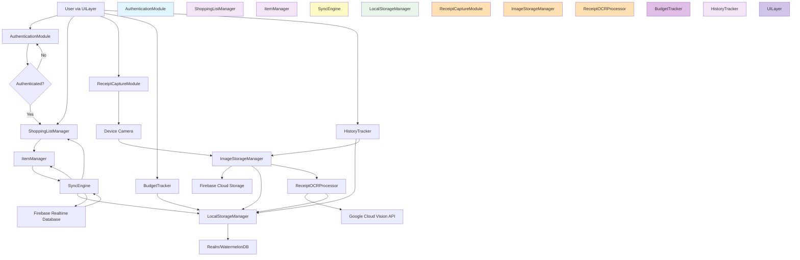

# Architectural Blueprint

## 1. Core Objective

Build a React Native mobile application (iOS and Android) enabling family members to collaboratively manage shopping lists in real-time across multiple devices, maintain complete historical records of all shopping trips, capture/store receipt images with automatic OCR text extraction, and track expenditures across date ranges. Success means seamless multi-user collaboration with automatic synchronization, reliable offline functionality, intelligent receipt data extraction, and comprehensive spending visibility accessible from any family member's device.

## 2. System Scope and Boundaries

### In Scope
- Real-time collaborative shopping list creation, editing, and deletion across family members
- Adding, checking off, and removing items from shopping lists with instant sync
- Capturing receipt photos using device camera with automatic boundary detection
- Storing receipt images in cloud storage associated with specific shopping trips
- Receipt OCR text extraction using Google Cloud Vision API (1,000 free/month, then $1.50 per 1,000)
- Extracting merchant name, date, total amount, and line items from receipt images
- Expenditure tracking with date-range filtering and total calculation
- Complete historical tracking of all shopping lists with timestamps and status
- Offline-first functionality allowing full app usage without connectivity
- User authentication and family group management
- Cross-platform support for iOS and Android via React Native
- Automatic data synchronization when devices reconnect to network
- View archived shopping trips with associated receipt images and extracted data

### Out of Scope
- Advanced budget planning with spending limits or alerts
- Push notifications for list updates (future enhancement)
- Barcode scanning for adding products
- Price comparison or store recommendations
- Web application version (mobile-only)
- Social features or sharing lists outside family group
- Integration with grocery store APIs or delivery services
- Voice input for adding items
- Smart suggestions based on purchase history

## 3. Core System Components

| Component Name | Single Responsibility |
|---|---|
| **AuthenticationModule** | Manages user registration, login, logout, and family group membership authentication via Firebase Authentication |
| **ShoppingListManager** | Creates, reads, updates, and deletes shopping lists including metadata (name, creation date, status, completion date) |
| **ItemManager** | Manages individual shopping list items including adding, editing, removing, and toggling checked/unchecked status |
| **SyncEngine** | Synchronizes all data (lists, items, metadata) between local storage and Firebase Realtime Database with conflict resolution |
| **LocalStorageManager** | Persists shopping lists, items, and metadata locally using Realm/WatermelonDB for offline access and fast queries |
| **ReceiptCaptureModule** | Interfaces with device camera to capture receipt photos with automatic document boundary detection and cropping |
| **ImageStorageManager** | Uploads receipt images to Firebase Cloud Storage, manages download URLs, and handles queued uploads during offline mode |
| **ReceiptOCRProcessor** | Sends receipt images to Google Cloud Vision API, extracts structured data (merchant, date, total, line items), and stores extracted data in database |
| **BudgetTracker** | Calculates total expenditure across shopping trips within user-specified date ranges and displays spending summaries |
| **HistoryTracker** | Retrieves and displays historical shopping trips filtered by date, status, or family member with associated receipts |
| **UILayer** | Renders React Native components for all user interactions including list views, item management, camera interface, and history browsing |

## 4. High-Level Data Flow

## 5. Key Integration Points

### Internal Component Integration

- **UILayer ↔ AuthenticationModule**: REST-like API calls for login/signup/logout operations with Promise-based responses
- **UILayer ↔ ShoppingListManager**: Direct function calls with observable/reactive patterns for list CRUD operations
- **ShoppingListManager ↔ ItemManager**: Function calls passing list IDs to manage items within specific lists
- **ItemManager ↔ SyncEngine**: Event-driven updates triggering sync operations on item changes (add/edit/delete/toggle)
- **ShoppingListManager ↔ SyncEngine**: Event-driven updates triggering sync operations on list changes (create/update/delete/complete)
- **SyncEngine ↔ LocalStorageManager**: Direct database query/write operations using Realm/WatermelonDB APIs with transaction support
- **UILayer ↔ ReceiptCaptureModule**: Async function calls opening camera interface, returning Promise with captured image file path
- **ReceiptCaptureModule ↔ ImageStorageManager**: Function call passing image file path for upload, receiving Promise with storage reference
- **ImageStorageManager ↔ ReceiptOCRProcessor**: Function call passing uploaded image URL, triggering OCR processing asynchronously
- **ReceiptOCRProcessor ↔ LocalStorageManager**: Direct database write operations storing extracted receipt data (merchant, date, total, items) linked to shopping list
- **UILayer ↔ BudgetTracker**: Function calls with date range parameters, receiving Promise with calculated expenditure totals and breakdown
- **BudgetTracker ↔ LocalStorageManager**: Query operations aggregating receipt totals within specified date ranges
- **HistoryTracker ↔ LocalStorageManager**: Query operations with filter parameters (date range, status) returning Promise with result sets
- **HistoryTracker ↔ ImageStorageManager**: Fetch operations using storage references to retrieve downloadable URLs for receipt images

### External Service Integration

- **AuthenticationModule ↔ Firebase Authentication**: HTTPS REST API using Firebase SDK for authentication operations with JWT tokens
- **SyncEngine ↔ Firebase Realtime Database**: WebSocket connection via Firebase SDK for bi-directional real-time data synchronization with JSON payloads
- **ImageStorageManager ↔ Firebase Cloud Storage**: HTTPS multipart/form-data uploads via Firebase SDK with progress callbacks and CDN URLs for downloads
- **ReceiptOCRProcessor ↔ Google Cloud Vision API**: HTTPS REST API with base64-encoded image payloads, receiving JSON responses with extracted text and confidence scores (1,000 free requests/month, $1.50 per 1,000 thereafter)
- **Authentication**: All Firebase operations require valid authentication tokens obtained from AuthenticationModule; Google Cloud Vision API requires API key authentication
- **Data Format**: JSON for database operations and API responses; multipart/form-data for image uploads; base64 for OCR image payloads; JWT tokens for Firebase authentication
- **Offline Handling**: SyncEngine maintains operation queue; ImageStorageManager maintains upload queue; ReceiptOCRProcessor queues OCR requests when offline; all process queues on reconnection
- **Conflict Resolution**: Firebase transactions for simultaneous multi-user edits; last-write-wins for non-critical fields; server timestamp as source of truth

---

**Architectural Blueprint Complete**: Component mapping established with clear single responsibilities, data flow visualization showing complete system journey, and integration points specified with protocols and data formats. All component names defined here (**AuthenticationModule**, **ShoppingListManager**, **ItemManager**, **SyncEngine**, **LocalStorageManager**, **ReceiptCaptureModule**, **ImageStorageManager**, **ReceiptOCRProcessor**, **BudgetTracker**, **HistoryTracker**, **UILayer**) will be used consistently across all subsequent documents.

**Ready to proceed to Phase 2: Requirements Generation?**
